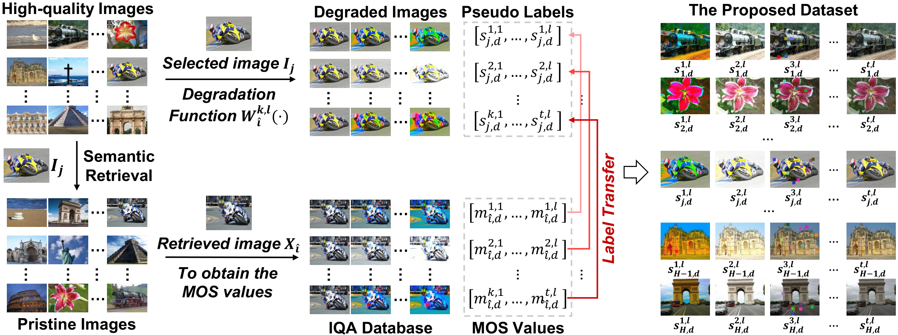
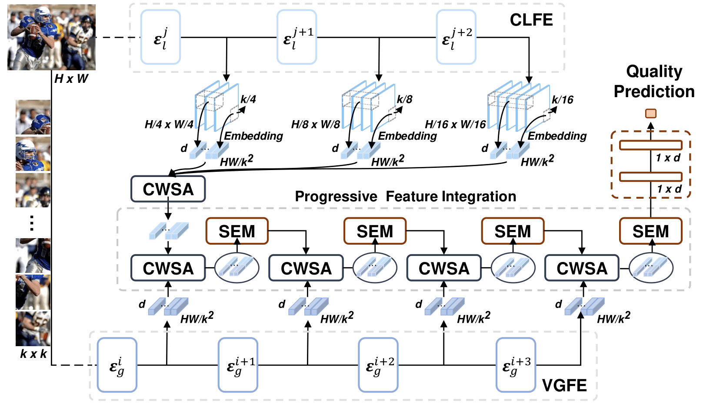

<h2 align="center"> No-Reference Image Quality Assessment with Global-Local Progressive Integration and Semantic-Aligned Quality Transfer

## 📊 Dataset Creation Pipeline
<div align="center"> 

</div>

The "create_dataset" folder contains all the necessary scripts to generate the pre-training datasets. Follow these steps to create the dataset:

 
### Step 1: Semantic Feature Extraction
Configure the IQA dataset parameters in create_dataset/utils.py. Then, run the following command to extract the semantic features of the IQA dataset:
```bash
python step1_iqadataset_semantics.py --dataset kadid-10k --model_name resnet50 --output_dir ./info_save
```
### Step 2: Find Semantically Similar Images
Next, search for semantically similar images between the reference dataset ([KADIS-700k](https://database.mmsp-kn.de/kadid-10k-database.html), [[download the dataset (44.6 GB)]](https://datasets.vqa.mmsp-kn.de/archives/kadis700k.zip)) and IQA dataset:

```bash
# Option 1: Find similar images in KADID-10k dataset
python step2_kadis_sim_img_in_iqadataset.py --dataset kadid-10k --kadis_ref_imgs_path path\to\kadis700k\ref_imgs --kadis_list ./info_save/selected_kadis_imgs50k.txt
# Output: info_save/similarity_img_in_kadid-10k.csv

# Option 2: Find similar images across multiple IQA datasets
python step2_kadis_sim_img_in_iqadataset_v2.py
# Output: info_save/similarity_img_in_iqadataset.csv
```
### Step 3: Transfer Quality Labels
Transfer quality labels from the IQA dataset to the target dataset (SAQT-IQA dataset):
```bash
python step3_labels_transfer.py --kadid_path path\to\kadid10k --similarity_file ./info_save/similarity_img_in_kadid-10k.csv --output_dir ./labels --batch_size 1000
```
By default, the script uses "similarity_img_in_kadid-10k.csv", but you can also use "similarity_img_in_iqadataset.csv". The batch_size parameter determines how many images are processed per output CSV file (recommended to keep at 1000).
 
  
### Step 4: Generate Distorted Images
Generate the distorted images using the MATLAB script:
- Navigate to the "generate_dis_img" directory
- Modify the dataset paths in "dataset_generator.m" as needed
- Execute the script to generate distorted images based on your chosen similarity file ("similarity_img_in_kadid-10k.csv" or "similarity_img_in_iqadataset.csv")

TODO:
- [x] Step 1: Model architecture details
- [x] Step 2: Training procedures and hyperparameters
- [x] Step 3: Evaluation results and comparisons
- [x] Step 4: Pre-trained models
 

 
## 🤖 Model Structure
 
<div align="center"> 
  
</div>

```bash
Coming soon
```
